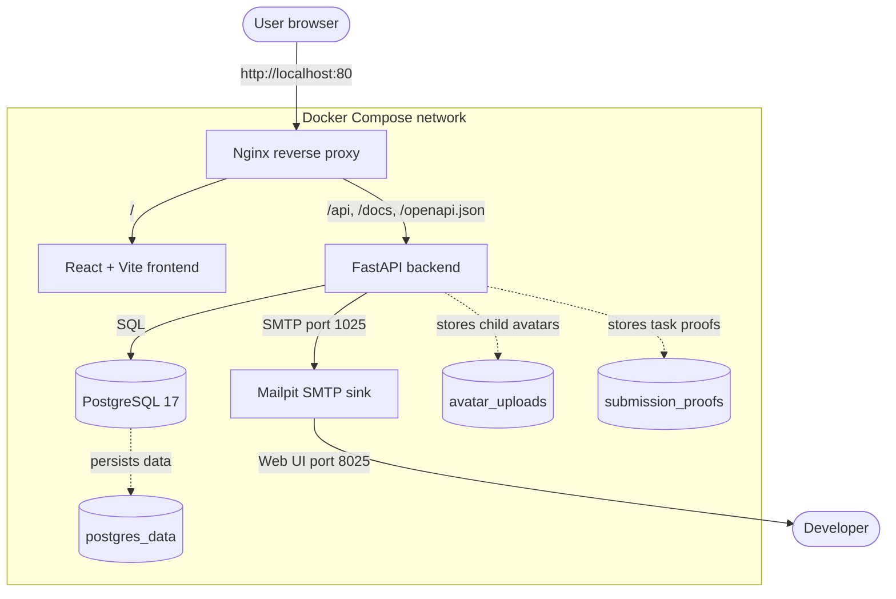
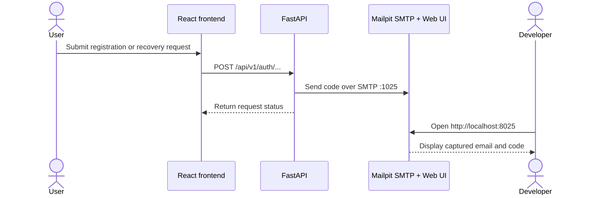
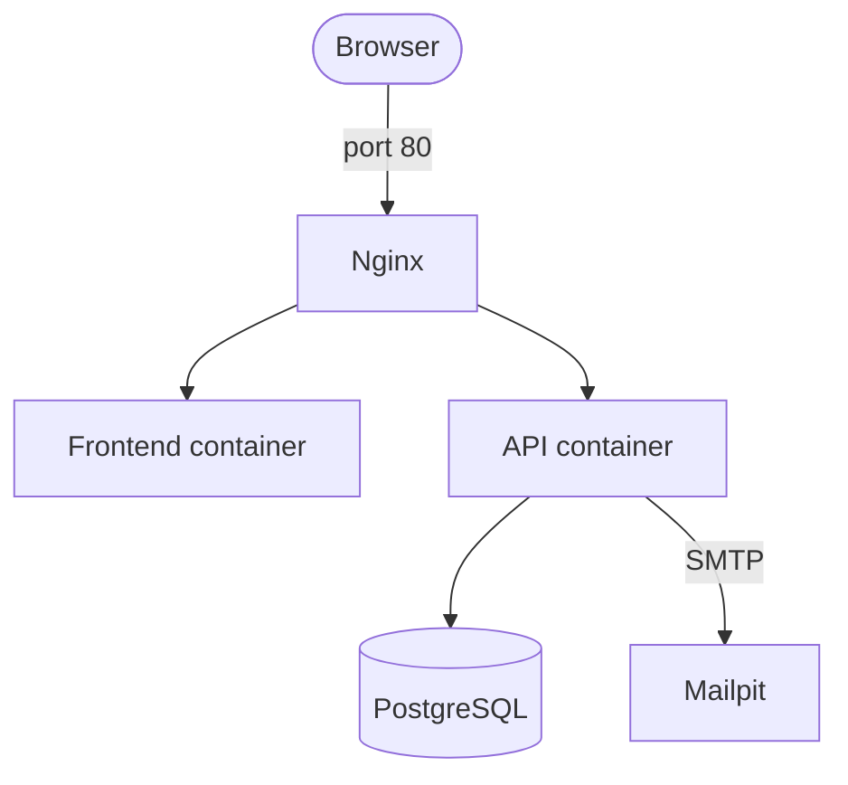
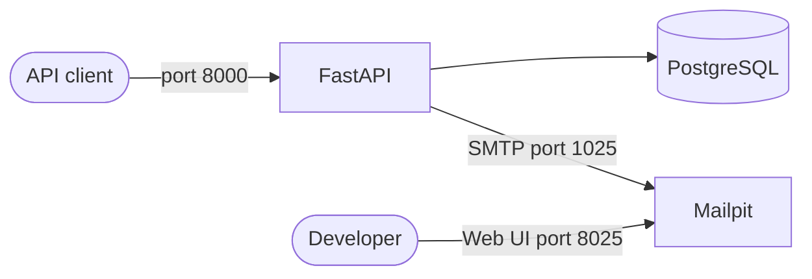

# EarnIt

EarnIt is a family allowance application that turns household responsibilities
into points, savings, and child-defined goals. Parents manage profiles, tasks,
rewards, and approvals, while children complete tasks and track their progress.

## Architecture

The full development stack runs with Docker Compose behind Nginx:

- **Nginx** is the public entrypoint on port `80`.
- **React + Vite** serves the single-page application.
- **FastAPI** exposes the API and OpenAPI documentation.
- **PostgreSQL 17** stores accounts, profiles, tasks, wallets, and goals.
- **Mailpit** captures development emails for account verification and
  password/PIN recovery.
- Named Docker volumes persist PostgreSQL data, child avatars, and task proofs.

The browser uses only Nginx for application traffic. Nginx routes `/` to the
frontend and `/api`, `/docs`, and `/openapi.json` to FastAPI. FastAPI connects
to PostgreSQL and sends email through Mailpit's internal SMTP endpoint.
Mailpit's web interface is exposed separately for developers.



## Tech Stack

- **Frontend:** React 19, TypeScript, Vite, Bun, TanStack Query, Tailwind CSS
- **Backend:** Python 3.14+, FastAPI, SQLModel, Alembic, uv
- **Data:** PostgreSQL 17
- **Development email:** Mailpit
- **Gateway:** Nginx
- **Local orchestration:** Docker Compose

See the detailed [frontend documentation](frontend/README.md) and
[backend documentation](backend/README.md).

## Quick Start

### Prerequisites

- Docker with Docker Compose
- `make`

### 1. Configure the backend

```bash
cp backend/.env.example backend/.env
```

Replace `SECRET_KEY` in `backend/.env` with a generated value:

```bash
openssl rand -hex 32
```

### 2. Start the full stack

```bash
make up
```

The API container applies pending Alembic migrations automatically before
starting FastAPI.

### 3. Open the services

| Service | URL | Purpose |
| --- | --- | --- |
| EarnIt | <http://localhost> | Application through Nginx |
| API documentation | <http://localhost/docs> | FastAPI Swagger UI |
| OpenAPI schema | <http://localhost/openapi.json> | API contract |
| Mailpit | <http://localhost:8025> | Captured development emails |
| PostgreSQL | `localhost:5432` | Direct local database access |
| Mailpit SMTP | `localhost:1025` | Direct local SMTP access |

To stop the stack:

```bash
make down
```

> `make down` removes containers but preserves the named data volumes.

## Mailpit Email Flow

Mailpit is a local development email sink. It does not deliver messages to real
inboxes. FastAPI sends SMTP messages to the `mailpit` Compose service on port
`1025`, and developers inspect them in the Mailpit web UI on port `8025`.

EarnIt currently uses email for:

- account verification codes;
- forgotten-password reset codes;
- parental PIN reset codes.



Mail configuration is controlled by the backend environment:

| Variable | Development default | Description |
| --- | --- | --- |
| `MAIL_SERVER` | `mailpit` | SMTP hostname inside Docker Compose |
| `MAIL_PORT` | `1025` | Mailpit SMTP port |
| `MAIL_FROM` | `noreply@earnit.app` | Sender address |

When running FastAPI directly on the host instead of in Docker, set
`MAIL_SERVER=localhost`.

## Development Modes

### Full stack

Use the root Compose file when testing the application end to end:

```bash
docker compose up --build
```



### Backend only

The backend Compose stack starts FastAPI, PostgreSQL, and Mailpit:

```bash
cd backend
docker compose up --build
```

- API documentation: <http://localhost:8000/docs>
- Mailpit: <http://localhost:8025>
- PostgreSQL: `localhost:5432`



### Frontend only

```bash
cd frontend
docker compose up --build
```

The containerized frontend is available at <http://localhost:3000>. For local
development with Bun, see the [frontend README](frontend/README.md).

## Repository Structure

```text
.
├── backend/            FastAPI application, migrations, tests, and backend Compose stack
├── frontend/           React application and frontend Compose stack
├── nginx-config/       Nginx routing configuration
├── docs/               Project contribution documentation
├── compose.yaml        Full-stack Docker Compose definition
├── Makefile            Full-stack convenience commands
└── CODEX.md            Project engineering guidelines
```

## Contribution Guide

See the [contribution guide](docs/contribute_guide.md) and
[project coding guidelines](CODEX.md).

## AI Usage

### Phase 1

- **Gemini** assisted with Phase 1 documentation and the initial repository
  structure.
- **Google Stitch** was used to generate wireframes and low-fidelity
  prototypes.
- **NotebookLM** was used as a project knowledge source.

### Phase 2

- **GPT-5.2-Codex** assisted with CI pipelines, documentation, and Docker
  Compose services.

### Phase 3 - Development

- **Claude Code** was used on the backend as a coding assistant across routers,
  services, models, schemas, tests, and documentation.
- **Codex** was used on the frontend for page creation, using the Figma MCP to
  reproduce pages planned and designed in Figma. Codex also implemented
  frontend components, input validation, UI animations, and fetching services
  that integrate the frontend with backend endpoints.
- Frontend work followed a spec-driven development flow using `spec.md`: Codex
  executed the implementation from the team's planning, requirements, and
  decisions rather than making product decisions independently.
- AI assistance helped with module planning, spec-first implementation for
  complex flows, reuse opportunities, boilerplate, tests, documentation, and
  mechanical cleanup.
- A minimalism-focused review pass was used to identify speculative
  abstractions, duplicated logic, and dead configuration; the team reviewed each
  suggestion before accepting changes.
- The team reviewed and understood all AI-assisted code. Architectural choices,
  the data model, frontend flows, UI behavior, and auth/verification decisions
  remained team-owned, and AI suggestions were overridden when they did not fit
  the project.
- See [backend/docs/AI_USAGE.md](backend/docs/AI_USAGE.md) for the detailed
  backend AI usage statement.
