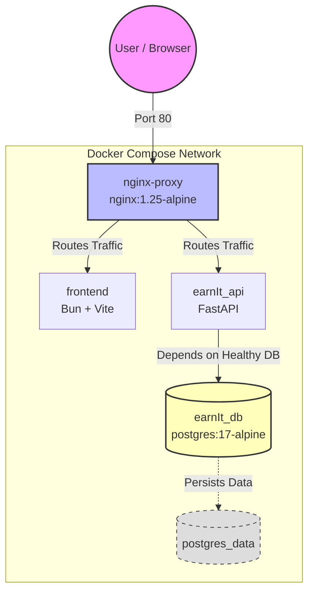
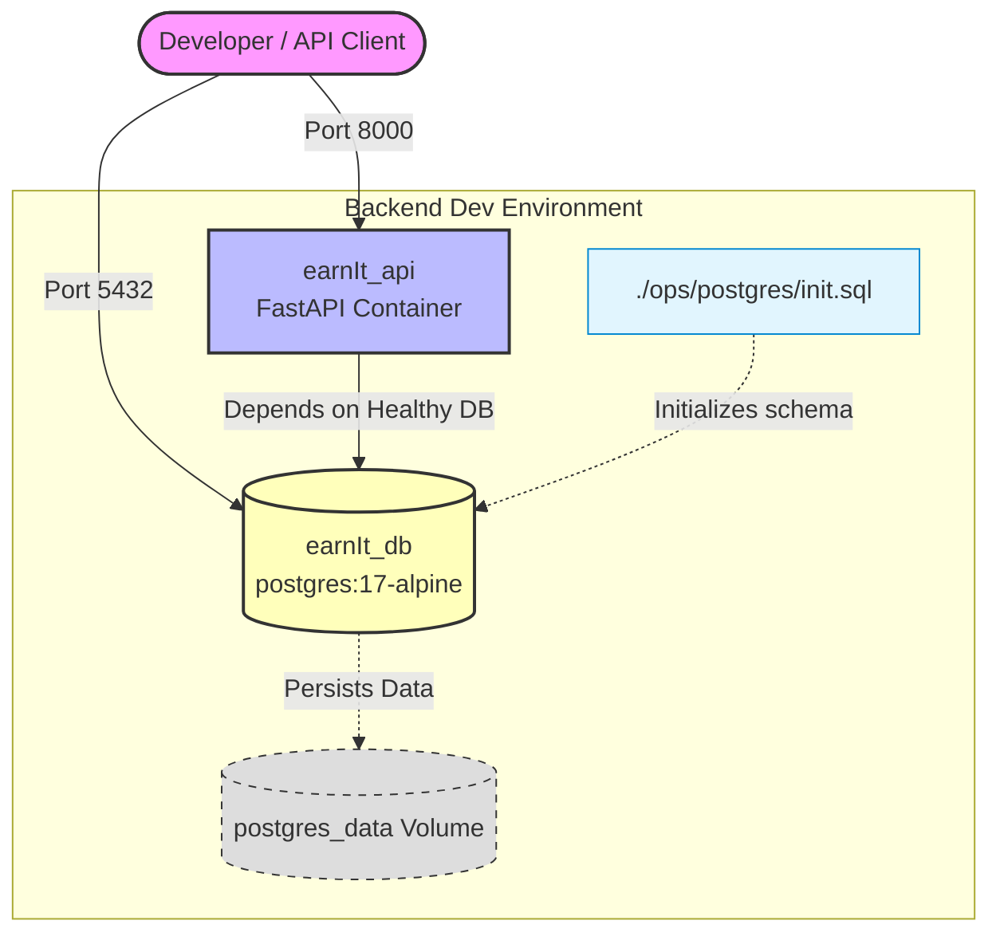
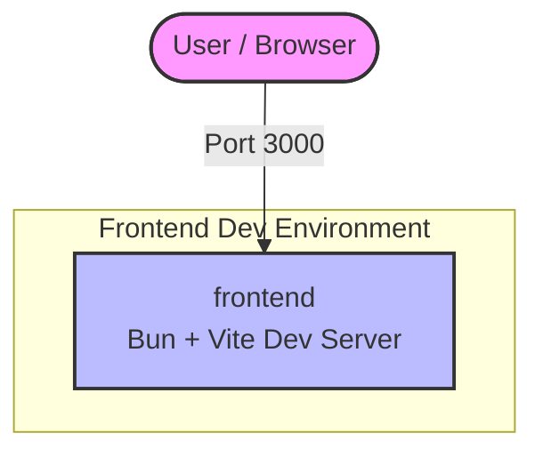

# EarnIt

# Architecture

The app is a React SPA served by Vite, talking to a FastAPI backend. FastAPI persists data in PostgreSQL. In the full stack setup, Nginx is the single public entrypoint on port 80: it routes `/` to the Vite dev server for the SPA, and `/api`, `/docs`, and `/openapi.json` to FastAPI. FastAPI then reads/writes to PostgreSQL on the internal Docker network, while the browser only ever talks to Nginx.

For development, you can run the full stack or run the backend and frontend separately (as shown below). Backend-only runs expose the API directly on port 8000 for `/docs`, while frontend-only runs expose the Vite dev server on port 3000.

# Development Architecture Backend

# Development Architecture Frontend

# Contribution Guide

See [docs/contribute_guide.md](docs/contribute_guide.md).

# AI Usage section

## Phase 1
- **Gemini** helped in all documentation (deliverables of Phase 1).
- **Google Stich** is being used to generate the wireframes and low-fidelity prototypes of the application.
- **Gemini** helped configure the project folder structure and create compose-yaml with the servicos defined by the Product Owner.
- **NootbookLM** is being used for its sources to be the source of truth, for any question about the current state of the project, stack, which epic is being attacked...etc.

## Phase 2
- **GPT-5.2-Codex** helps build the CI pipelines, documentation, and compose services to run the full stack, following my guides.
