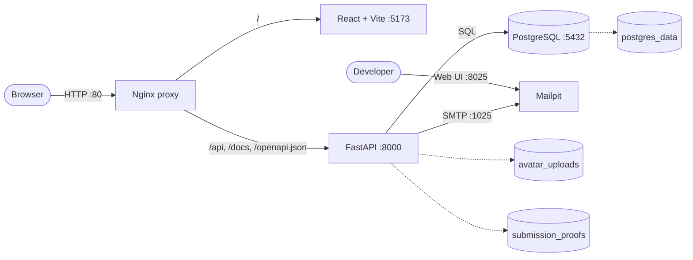

# EarnIt — Tech Stack & Infrastructure

## Executive Overview

This document is the current source of truth for EarnIt's technical stack,
runtime infrastructure, development workflows, and architectural conventions.
It reflects the implementation in the repository rather than planned or
aspirational tooling.

EarnIt is a family allowance application in which parents manage child
profiles, recurring duties, extra tasks, approvals, points, and goals. Children
use profiles within the authenticated family session; they do not have separate
login credentials.

## Changes from the Previous Document

The previous document mixed implemented technology with architectural
intentions. This revision was validated against the current source code,
dependency manifests, Docker Compose files, environment configuration, and CI
workflow.

| Area | Previous document | Current document | Reason for the change |
| --- | --- | --- | --- |
| Document scope | Generic technical plan with some proposed decisions. | Repository-backed source of truth for the current tech stack and infrastructure. | To distinguish implemented behavior from future intentions. |
| Dependency versions | Several dependencies were described only as `Latest`. | Exact version constraints from `pyproject.toml`, `package.json`, and Docker images are listed. | `Latest` is ambiguous and becomes outdated quickly; repository versions make the document reproducible. |
| Backend stack | Listed the main framework, ORM, database, and migrations. | Also documents asyncpg, PyJWT, bcrypt, fastapi-mail, uv, and migration startup behavior. | These components are part of the actual runtime and security/email architecture. |
| Frontend stack | React, Vite, Tailwind, and shadcn/ui were described generically. | Adds TypeScript, React Router, TanStack Query, Bun, Radix primitives, and the native `fetch` wrapper. | To represent the frontend dependencies and communication layer that are actually in use. |
| Zustand | Presented as the selected global UI state manager. | Explicitly marked as not installed; React Context and local state are currently used. | The previous text described an architectural intention as an implemented dependency. |
| Frontend testing | Jest was listed as active tooling. | Jest, React Testing Library, and a frontend test script are listed as not currently configured. | There is no frontend test dependency or `test` command in `package.json`. |
| Code quality | pre-commit and `.editorconfig` were described as adopted but were not initially present. | Both are now implemented and documented, with Makefile commands for installation and execution. | The repository was updated to match the intended workflow instead of leaving it as documentation only. |
| Frontend pre-commit hook | Referred to a Bun built-in linter and formatter. | Runs the project's configured ESLint command. | Bun is the runtime/package manager; ESLint is the frontend linter actually configured by the project. |
| Mail infrastructure | Email infrastructure was absent. | Adds a dedicated Mailpit section covering SMTP, web UI, email flows, environment variables, local development, and CI. | Mailpit is a real Compose and CI service required by account verification and recovery flows. |
| Mail service name | Referred to informally as “MailTip”. | Corrected to **Mailpit**. | `axllent/mailpit` is the image and service used by the repository. |
| Full-stack services | Focused on Nginx, frontend, API, and PostgreSQL. | Documents all five services: Nginx, frontend, API, PostgreSQL, and Mailpit. | The service topology should match `compose.yaml`. |
| Public ports | Claimed that only Nginx exposed a host port. | Clarifies that Nginx is the browser gateway, while PostgreSQL and Mailpit ports are also exposed for development. | The root Compose file publishes ports `5432`, `1025`, and `8025` in addition to port `80`. |
| Frontend port | The combined-mode matrix referred to frontend port `3000`. | Combined mode uses internal port `5173`; isolated Docker mode exposes `3000`. | The root Nginx configuration proxies to Vite on `5173`, while `frontend/compose.yaml` uses `3000`. |
| Database initialization | Claimed that `postgres/init.sql` was mounted and seeded the database. | States that there is no active `init.sql` seed mount and that Alembic migrations run on API startup. | The seed mount is commented out; the API Docker command executes `alembic upgrade head`. |
| Persistence | Mentioned only the PostgreSQL data volume. | Adds PostgreSQL, avatar, and task-proof volumes and explains the current filesystem storage model. | The application now persists child avatars and submission evidence in named volumes. |
| Authentication | Described JWT cookies and PIN hashing at a high level. | Documents token scopes, cookie properties, bcrypt, CORS, credentialed requests, recovery behavior, and the development auth bypass. | To reflect the implemented security boundaries and operational risks more accurately. |
| PIN authorization | Suggested PIN verification as part of the security perimeter. | Clarifies that PIN verification does not create a separate privileged backend session. | The endpoint currently returns a frontend rendering signal; API authorization remains based on the family access token. |
| OpenAPI types | Suggested automatic generation as part of contract-first development. | Marks OpenAPI-to-TypeScript generation as a future improvement. | Frontend API types are currently maintained manually. |
| Background work | Not documented. | Adds the in-process daily maintenance loop for duty slots and unverified-account purging. | This is an important runtime responsibility with production scaling implications. |
| CI | Not described in detail. | Documents GitHub Actions checks and its PostgreSQL and Mailpit service containers. | CI is part of the implemented development infrastructure. |
| Production readiness | Mixed development and deployment language. | Adds an explicit production-gaps section. | The current setup uses Vite dev server, Uvicorn reload, HTTP, Mailpit, local volumes, and exposed development ports; it should not be presented as production-ready. |

## Core Technology Stack

### Backend and Data

| Component | Technology | Repository version | Notes |
| --- | --- | --- | --- |
| Language | Python | `>=3.14` | Runtime image: `python:3.14-slim`. |
| API framework | FastAPI | `>=0.136.3` | Async REST API with generated OpenAPI documentation. |
| ORM and validation | SQLModel | `>=0.0.38` | Built on SQLAlchemy and Pydantic. |
| Database driver | asyncpg | `>=0.31.0` | Asynchronous PostgreSQL access. |
| Primary database | PostgreSQL | `17-alpine` | Stores accounts, profiles, tasks, submissions, wallet transactions, and goals. |
| Migrations | Alembic | `>=1.18.4` | Migrations run automatically when the API container starts. |
| Authentication tokens | PyJWT | `>=2.13.0` | HS256-signed session tokens stored in HTTP-only cookies. |
| Password and PIN hashing | bcrypt | `>=5.0.0` | CPU-bound hashing is moved off the async event loop. |
| Email delivery | fastapi-mail | `>=1.6.4` | SMTP transport with Jinja2 HTML templates. |
| Package manager | uv | Current lockfile | Installs and locks Python dependencies. |

### Frontend

| Component | Technology | Repository version | Notes |
| --- | --- | --- | --- |
| UI framework | React | `^19.2.6` | Single-page application. |
| Language | TypeScript | `~6.0.2` | Strict TypeScript configuration. |
| Build tool | Vite | `^8.0.12` | Development server, HMR, and production builds. |
| Runtime and package manager | Bun | Lockfile-managed | Used for dependency installation and frontend commands. |
| Routing | React Router | `^7.17.0` | Client-side routes and protected-route behavior. |
| Server state | TanStack Query | `^5.101.0` | Query caching and async request lifecycle. |
| Styling | Tailwind CSS | `^4.3.0` | Integrated through the Vite plugin. |
| UI primitives | Radix UI and shadcn-style components | Repository-managed | Components live in `frontend/src/components/ui`; this is not a separately hosted UI service. |
| API transport | Native `fetch` | Browser API | `apiFetch` prefixes `/api/v1`, includes cookies, parses responses, and raises `ApiError`. |

React Context and local component state are currently used for authentication,
toasts, forms, and page-level UI state. **Zustand is not installed.** It should
only be introduced if unrelated parts of the application require persistent
shared client state.

## Infrastructure and Service Topology

The development environment is orchestrated with Docker Compose. The full stack
contains five services:

| Service | Image/runtime | Purpose |
| --- | --- | --- |
| `proxy` | `nginx:1.25-alpine` | Public application gateway and reverse proxy. |
| `frontend` | Node 24 image with Bun and Vite | React development server. |
| `api` | Python 3.14, uv, FastAPI/Uvicorn | API and business logic. |
| `db` | `postgres:17-alpine` | Relational persistence. |
| `mailpit` | `axllent/mailpit:v1.30.1` | Local SMTP sink and email inspection UI. |



### Nginx Gateway

Nginx is the single entry point for **browser application traffic**:

- `/` routes to the Vite frontend;
- `/api/` routes to FastAPI;
- `/docs` routes to Swagger UI;
- `/openapi.json` exposes the OpenAPI contract;
- WebSocket upgrade headers preserve Vite HMR through the proxy;
- API request bodies are limited to `6 MB` at the proxy.

In the full development Compose file, PostgreSQL, Mailpit SMTP, and the Mailpit
web UI are also exposed to the host for developer access. Therefore, it is not
accurate to say that Nginx is the only container with a host port; it is the only
gateway used by the application browser.

## Mailpit Development Email Infrastructure

> The correct product name is **Mailpit**. “MailTip” is not a service used by
> this repository.

Mailpit is an essential part of the local and CI infrastructure. It captures
outgoing development email without delivering messages to real inboxes.

- SMTP endpoint inside Docker: `mailpit:1025`;
- SMTP endpoint from the host: `localhost:1025`;
- email inspection UI: <http://localhost:8025>;
- no SMTP credentials or TLS are required in the development configuration;
- production must replace Mailpit with a real SMTP provider and appropriate
  credentials/TLS settings.

EarnIt uses email for:

- account verification;
- password recovery;
- parental PIN recovery.

The API renders HTML templates from `backend/src/email/` and sends them through
the shared `fastapi-mail` client. Verification and reset codes are not stored in
a dedicated database table; they are derived and validated using a
purpose-specific HMAC flow and expire after the configured window (10 minutes
by default).

Mailpit is included in:

- the root full-stack Compose environment;
- the isolated backend Compose environment;
- the GitHub Actions backend test job.

Relevant environment variables:

| Variable | Development default | Purpose |
| --- | --- | --- |
| `MAIL_SERVER` | `mailpit` | SMTP host inside Docker; use `localhost` when the API runs directly on the host. |
| `MAIL_PORT` | `1025` | SMTP port. |
| `MAIL_FROM` | `noreply@earnit.app` | Sender address. |
| `MAIL_USERNAME` | Empty | Reserved for a real SMTP provider. |
| `MAIL_PASSWORD` | Empty | Reserved for a real SMTP provider. |

## Persistence and Uploaded Files

The full stack uses named Docker volumes:

| Volume | Stored data |
| --- | --- |
| `postgres_data` | PostgreSQL database files. |
| `avatar_uploads` | Uploaded child avatars. |
| `submission_proofs` | Image evidence uploaded with task submissions. |

Avatar and proof uploads accept JPEG, PNG, or WebP images with a default maximum
size of `5 MB`. These files are currently stored on the API container's mounted
filesystem, not in object storage. A production deployment should define backup,
retention, access-control, and object-storage/CDN policies.

## Authentication and Security

- Parent sessions use HS256 JWTs signed with `SECRET_KEY`.
- Browser sessions are stored in `HttpOnly`, `Secure`, `SameSite=Lax` cookies.
- A pending-verification cookie is scoped to the email verification routes.
- A full `access_token` cookie is used after verification or login.
- The frontend sends requests with `credentials: "include"`.
- Passwords and parental PINs are salted and hashed with bcrypt.
- Parent PIN verification occurs at `POST /api/v1/auth/verify-pin`.
- Child profiles do not authenticate independently; they operate inside the
  parent's family session.
- Login and password-recovery behavior avoids disclosing whether an email is
  registered.
- CORS origins are configurable and credentialed requests are enabled.
- `DISABLE_AUTH=true` is a development-only bypass and must never be enabled in
  production.

The PIN check does not issue a separate privileged session or cookie. A
successful response is currently a frontend gate for rendering the parent
dashboard; protected API routes remain authorized by the family access token.

## API and Application Architecture

- The API is RESTful JSON under `/api/v1`.
- FastAPI publishes Swagger UI at `/docs` and the schema at `/openapi.json`.
- Backend layers are separated into API routes, schemas, services, models,
  security helpers, and database dependencies.
- The frontend uses service modules and a shared `apiFetch` wrapper.
- TanStack Query manages remote request state where adopted.
- Backend-owned data should not be duplicated in long-lived frontend global
  state.

Frontend API types are currently maintained in TypeScript source files.
Automatic OpenAPI type generation is a recommended future improvement, not an
implemented build step.

## Background Maintenance

FastAPI starts an in-process daily maintenance loop that:

- marks overdue duty slots as failed;
- generates the current day's slots for active recurring duties;
- purges unverified accounts after the configured limbo period.

The loop runs once at API startup and then at midnight. This is suitable for the
current single-process development architecture. A horizontally scaled
production deployment should move scheduled work to a dedicated scheduler or
worker with distributed locking to prevent duplicate execution.

## Development Modes

### Full Stack

```bash
cp backend/.env.example backend/.env
# Set a real SECRET_KEY in backend/.env:
openssl rand -hex 32

docker compose up --build
```

| Service | Address |
| --- | --- |
| Application | <http://localhost> |
| API documentation | <http://localhost/docs> |
| OpenAPI schema | <http://localhost/openapi.json> |
| Mailpit UI | <http://localhost:8025> |
| Mailpit SMTP | `localhost:1025` |
| PostgreSQL | `localhost:5432` |

In the integrated stack, the frontend listens internally on port `5173`. The
API and frontend are reached by the browser through Nginx.

### Backend Isolation

```bash
cd backend
docker compose up --build
```

- FastAPI and Swagger UI: <http://localhost:8000/docs>
- PostgreSQL: `localhost:5432`
- Mailpit UI: <http://localhost:8025>
- Mailpit SMTP: `localhost:1025`

The API waits for PostgreSQL's health check and for the Mailpit service to start.
Its container command applies `alembic upgrade head` before starting Uvicorn.
There is no active `init.sql` seed mount in the current Compose configuration.

### Frontend Isolation

```bash
cd frontend
docker compose up --build
```

The isolated frontend is available at <http://localhost:3000>. The source tree
is bind-mounted for Vite HMR.

For direct host development:

```bash
cd frontend
bun install
bun run dev
```

Vite then defaults to <http://localhost:5173>.

## Ports Reference

| Service | Full stack | Isolated mode |
| --- | --- | --- |
| Nginx | Host `80` | Not used |
| Frontend | Internal `5173`, reached through Nginx | Host `3000` in Docker or `5173` with local Vite |
| FastAPI | Internal `8000`, reached through Nginx | Host `8000` |
| PostgreSQL | Host and container `5432` | Host and container `5432` |
| Mailpit SMTP | Host and container `1025` | Host and container `1025` |
| Mailpit UI | Host and container `8025` | Host and container `8025` |

## Testing, Quality, and CI

### Implemented

- Backend linting and formatting: Ruff.
- Backend tests: Pytest, pytest-asyncio, and pytest-cov.
- Frontend linting: ESLint.
- Frontend validation: TypeScript compilation and Vite production build.
- Editor consistency: root `.editorconfig` rules for Python, frontend files,
  Markdown, shell scripts, YAML, and Makefiles.
- Commit-time validation: pre-commit checks whitespace, final newlines, YAML,
  merge-conflict markers, large files, backend Ruff, and frontend ESLint.
- CI: GitHub Actions runs backend Ruff checks, frontend ESLint, and backend
  Pytest with PostgreSQL and Mailpit service containers.

Useful commands:

```bash
# Backend
cd backend
uv run ruff check .
uv run ruff format --check .
uv run pytest -q

# Frontend
cd frontend
bun run lint
bun run build

# Install the Git hook from the repository root
make pre-commit-install

# Run the same hooks against all tracked files
make pre-commit-run
```

### Not Currently Configured

The following items appeared in earlier architecture notes but are not present
in the repository:

- Jest or another frontend test runner;
- React Testing Library;
- a frontend `test` script;
- Zustand;
- automatic OpenAPI-to-TypeScript generation.

These should be described as roadmap items until they are added and enforced.

## Deployment Status and Production Gaps

The repository currently defines a development-oriented architecture:

- Vite runs as a development server behind Nginx;
- Uvicorn runs with `--reload`;
- Nginx listens on HTTP port 80;
- Mailpit captures email;
- uploaded images use local Docker volumes;
- PostgreSQL and Mailpit ports are exposed to the host.

Before production deployment, the infrastructure should add:

- a compiled frontend build served as static assets;
- a non-reloading API process with an explicit worker strategy;
- TLS termination and secure domain configuration;
- a real SMTP provider;
- managed secrets;
- database backups and restore testing;
- durable object storage for uploads;
- monitoring, centralized logs, and health/readiness endpoints;
- restricted database and SMTP exposure;
- a production scheduler/worker for daily maintenance.

## Local Prerequisites

- Docker with Docker Compose;
- `make` for convenience targets;
- Bun for direct frontend work;
- uv for direct backend work.
